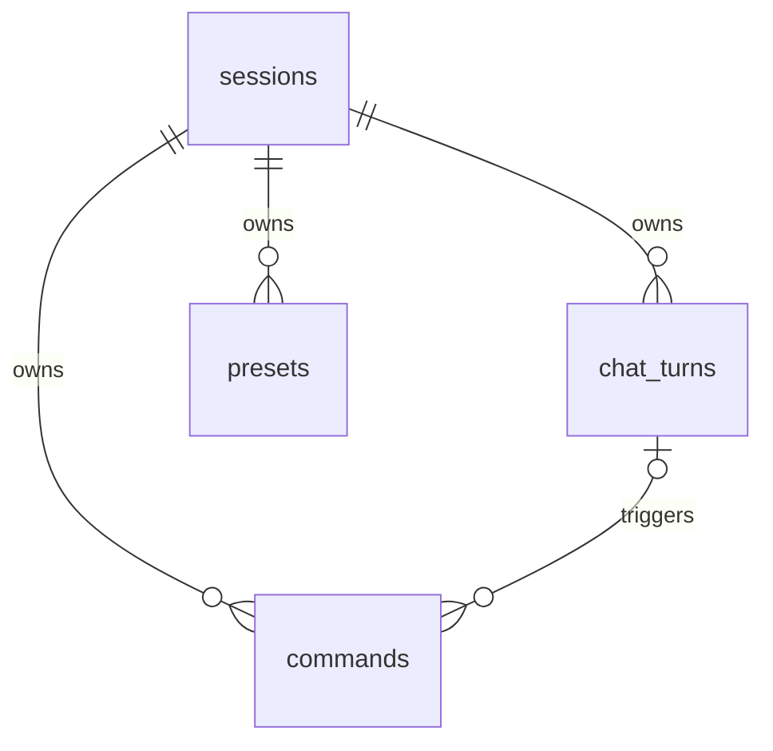

# Luma Smart Light

ระบบควบคุมความสว่างของ LED บน ESP32 ผ่านเว็บ รองรับการปรับค่าโดยตรง คำสั่งภาษาไทย/English คำสั่งเสียง และเสียงตอบกลับจากเบราว์เซอร์ โดยไม่ใช้ AI API ภายนอก

## ส่วนประกอบ

- `src/` และ `include/`: firmware Arduino สำหรับ ESP32
- `web/`: หน้าเว็บ Next.js ตัวแปลคำสั่งแบบ local, Qwen fallback และ API ที่เชื่อมต่อ ESP32
- `deploy/`: ตัวอย่าง service และการจำกัดทรัพยากรสำหรับ Raspberry Pi (ใช้งานจริงให้ Pi รันเฉพาะ Ollama)
- LED ใช้ GPIO 2 และปรับความสว่างด้วย PWM

ESP32 เปิด HTTP API ภายในเครือข่าย:

- `GET /status` อ่านความสว่างและสถานะปัจจุบัน
- `POST /light?brightness=70` ตั้งความสว่างระหว่าง 0–100%
- `POST /blink?brightness=80&onMs=200&offMs=300&count=5` กระพริบ 5 ครั้ง
- `POST /blink?brightness=100&onMs=500&offMs=500&count=0` กระพริบต่อเนื่อง
- `POST /blink/stop` หยุดกระพริบและกลับไปความสว่างก่อนหน้า

## การตั้งค่า ESP32

1. คัดลอก `include/secrets.example.h` เป็น `include/secrets.h`
2. ใส่ชื่อและรหัสผ่าน Wi-Fi ใน `include/secrets.h`
3. build และ upload ด้วย PlatformIO:

```bash
pio run
pio run --target upload
pio device monitor
```

หลังเชื่อมต่อสำเร็จ Serial Monitor จะแสดง IP address ของ ESP32

## การตั้งค่าเว็บ

ต้องใช้ Node.js และ npm

```bash
cd web
cp .env.example .env.local
npm install
npm run dev
```

แก้ค่าใน `web/.env.local`:

```dotenv
ESP32_BASE_URL=http://IP_ADDRESS_OF_ESP32
OLLAMA_BASE_URL=http://127.0.0.1:11434
OLLAMA_MODEL=qwen3:0.6b
# เฉพาะบน Pi ที่ใช้บริการเสียงแยก: TTS_BASE_URL=http://127.0.0.1:8765
```

จากนั้นเปิด `http://localhost:3000`

เว็บของเพื่อนสามารถออกแบบเองและเรียก API เวอร์ชัน 1 ได้โดยไม่ต้องเข้าถึง Pi หรือ ESP32 โดยตรง สัญญา endpoint, การตั้ง API key/CORS และ prompt ให้ AI ของเพื่อนสร้างหน้าเว็บอยู่ใน [`web/FRIEND_API.md`](web/FRIEND_API.md) โค้ด API อยู่ที่ `web/app/api/v1/[...resource]/route.ts` การอัป GitHub อย่างเดียวไม่ทำให้ API ออนไลน์: โฮสต์ที่ deploy ต้องเข้าถึง ESP32 และ Ollama ในเครือข่ายบ้านได้ก่อน

### เสียงตอบกลับภาษาไทยบนเครื่องพัฒนา

ถ้ารันเว็บบนเครื่องพัฒนา ให้ติดตั้ง VachanaTTS ใน virtual environment แยก (แนะนำ Python 3.12) แล้วเว็บจะสร้างเสียงผ่าน `/api/speech` ในพอร์ตเว็บเดียวกัน ไม่ต้องเปิดเซิร์ฟเวอร์เสียงแยก:

```bash
uv venv --python 3.12 tts/.venv
uv pip install --python tts/.venv/bin/python -r tts/requirements.txt
cd tts && .venv/bin/python synthesize.py "ทดสอบเสียงไทย" /tmp/luma-tts-test.wav
cd ../web
npm run dev
```

เปิดเว็บที่ `http://localhost:3000` ขั้น synthesize ครั้งแรกจะดาวน์โหลดโมเดล `th_f_2` ลงใน `tts/voices/` ก่อนเปิดเว็บ เพื่อไม่ให้คำขอแรกหมดเวลา; ไฟล์เสียงที่สร้างแล้วอยู่ใน `tts/cache/` ทั้งสองโฟลเดอร์ไม่ถูก commit ถ้ากำหนด `TTS_BASE_URL` ใน environment เว็บจะใช้บริการเสียงแยกตามค่านั้นแทน (สำหรับการรันบน Pi) เสียงยังเป็นโมเดล VachanaTTS ตัวเดิม การย้ายมารันบนคอมไม่ได้เปลี่ยนคุณภาพของโมเดล

ESP32 และเครื่องที่รันเว็บต้องมองเห็นกันผ่านเครือข่าย และ `ESP32_BASE_URL` ต้องชี้ไปยัง IP ปัจจุบันของบอร์ด

คำสั่งที่ตรงไปตรงมา เช่น `เปิดไฟ`, `ปิดไฟ`, `turn on the light` ใช้ parser โดยไม่โหลดโมเดล ส่วนประโยคเกี่ยวกับไฟที่ parser ไม่รู้จักจะส่งให้ Ollama พร้อมสถานะ ESP32 และคำขอของผู้ใช้ก่อนหน้า โมเดลเสนอการกระทำเป็น JSON และโค้ดตรวจความสอดคล้องกับข้อความล่าสุดก่อนส่งคำสั่ง หากไม่เข้าใจหรือโมเดลล้มเหลวจะตอบว่าไม่รู้จักโดยไม่เปลี่ยนไฟ โมเดลถูกเรียกด้วย `keep_alive: 0` เพื่อคืน RAM หลังตอบ

คำสั่งต่อเนื่องอย่าง `ขอจังหวะช้าลงอีกนิด` ใช้สถานะกระพริบปัจจุบัน: ช้าลงเพิ่มเวลาติด/ดับเป็นสองเท่า เร็วขึ้นลดเวลาครึ่งหนึ่ง ภายใน 50–5000 ms โดยรักษาความสว่างและจำนวนครั้งที่เหลือ การสั่งเปิดไฟที่เปิดค้างอยู่แล้วจะคงระดับความสว่างเดิมและตอบว่าเปิดอยู่แล้ว ระบบนี้จำกัดเฉพาะเรื่องไฟ ไม่ใช่แชตทั่วไป และยังไม่รับประกันว่าจะเข้าใจทุกสำนวน

ทดสอบรวมกับเว็บและบอร์ดจริง: `cd web && node scripts/check-light-chat.mjs` (เปลี่ยนไฟระหว่างทดสอบแล้วคืนความสว่างเดิม; ต้องเริ่มขณะไฟไม่ได้กระพริบ) กำหนด `LUMA_URL` หากเว็บไม่ได้อยู่ที่ localhost:3000

คำสั่งกระพริบตัวอย่าง: `กระพริบไฟเร็ว 5 ครั้ง`, `กระพริบไฟช้า ความสว่าง 70%`, `กระพริบไฟต่อเนื่อง`, `หยุดกระพริบ`, `blink slowly 2 times at 40 percent` หน้าเว็บมี Blink Control สำหรับกำหนดความสว่าง เวลาติด เวลาดับ และจำนวนครั้งเอง โดยจำนวน `0` หมายถึงต่อเนื่อง

## การแยกหน้าที่เครื่องและประวัติ

เครื่องที่เปิด Next.js รันเว็บ, SQLite และเสียงไทย ส่วน Raspberry Pi 5 (RAM 4 GB) รันเฉพาะ Ollama AI; ESP32 ควบคุมไฟจริง การใช้ SSH tunnel จากเครื่องเว็บไปยัง Ollama บน Pi ทำให้ Pi ไม่ต้องรันเว็บ

SQLite อยู่ที่ `web/data/luma.sqlite` บนเครื่องเว็บ หรือเปลี่ยนด้วย `DATABASE_PATH` เมื่อเปิดหน้าเว็บแต่ละครั้ง ระบบสร้าง session ใหม่สำหรับแชตและประวัติคำสั่งที่แสดงบนหน้า ดังนั้นปิดเว็บแล้วเปิดใหม่หรือรีเฟรชจะเริ่มแชตใหม่ แต่ข้อมูลเก่ายังอยู่ใน SQLite เพื่อการตรวจสอบและสาธิตฐานข้อมูล โหมดไฟที่บันทึกไว้ใช้คุกกี้ของเบราว์เซอร์แยกต่างหาก จึงยังอยู่หลังเปิดเว็บใหม่

ตาราง `sessions` เป็นเจ้าของ `chat_turns` (ข้อความ ผลตอบ และเวลาประมวลผล), `commands` (คำสั่งที่ส่งถึงบอร์ด ผลยืนยัน และแหล่งที่มา), และ `presets` (ชื่อโหมด รูปแบบ ความสว่าง และจังหวะกระพริบ) `commands.turn_id` อ้างอิงข้อความแชตที่ทำให้เกิดคำสั่ง มี foreign key, CHECK, UNIQUE และ index ตาม session เพื่ออธิบายความถูกต้องและการค้นข้อมูลในรายงานได้ ไฟล์ schema อยู่ที่ `web/lib/database.ts` และ API อยู่ที่ `/api/history` กับ `/api/presets` สถานะไฟปัจจุบันยังอ่านจาก ESP32

ตัวอย่าง SQL สำหรับสาธิต: `SELECT input, reply, outcome, created_at FROM chat_turns ORDER BY id DESC LIMIT 10;` และ `SELECT source, path, outcome, created_at FROM commands ORDER BY id DESC LIMIT 10;` ทดสอบ API และบอร์ดจริงจากเครื่องเว็บด้วย `cd web && node scripts/check-database.mjs` เมื่อ ESP32 ออนไลน์ สำรองฐานข้อมูลด้วย `node scripts/backup-database.mjs data/luma-backup.sqlite` จากโฟลเดอร์ `web`; สคริปต์นี้ใช้ SQLite backup API จึงรวมข้อมูลที่ยังอยู่ใน WAL ได้ด้วย

ความสัมพันธ์สำหรับอธิบายในรายงาน:



บน Pi เลือก `qwen3:0.6b` เพื่อให้เบา และจำกัด Ollama ไว้ที่ RAM 1.8 GB, CPU 250%, โหลดโมเดลพร้อมกันหนึ่งตัว และประมวลผลทีละคำสั่ง ตัวอย่างการจำกัดทรัพยากรอยู่ใน `deploy/`

```bash
ollama pull qwen3:0.6b
sudo mkdir -p /etc/systemd/system/ollama.service.d
sudo cp deploy/ollama-raspi.conf /etc/systemd/system/ollama.service.d/raspi-limits.conf
sudo systemctl daemon-reload
sudo systemctl restart ollama
```

หน้าเว็บเปิดบนเครื่องที่รัน Next.js เช่น `http://localhost:3000` ไม่ใช่บน Pi เสียงตอบกลับภาษาไทยสร้างด้วย VachanaTTS/ONNX บนเครื่องเว็บ ส่วนเสียงภาษาอังกฤษใช้เสียงของเบราว์เซอร์

## ทดสอบ LED ที่ GPIO2 / D2

อัปโหลด firmware ทดสอบที่ทำให้ GPIO2 สลับ HIGH/LOW ทุก 500 ms:

```bash
pio run -e d2test --target upload
pio device monitor --baud 115200
```

เมื่อทดสอบเสร็จ อัปโหลด firmware Smart Light กลับด้วย:

```bash
pio run -e esp32dev --target upload
```

## ความปลอดภัย

ไฟล์ `include/secrets.h` และ `web/.env.local` ถูกระบุใน `.gitignore` ห้าม commit ไฟล์เหล่านี้ หาก credential เคยอยู่ใน Git history ให้เปลี่ยน credential ด้วย เพราะการลบออกจากไฟล์ปัจจุบันไม่ได้ลบออกจากประวัติ
